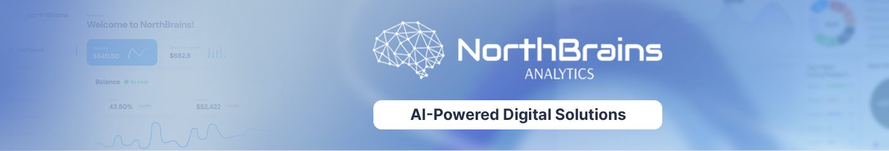
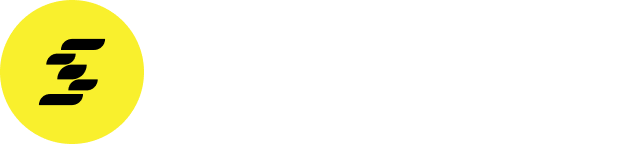

  

    

  **AI Solutions 🤖 &nbsp;·&nbsp; Mobile-First AI Applications 📱**

  We design machine learning models and ship them as 
  beautiful, intuitive mobile experiences — straight from Poland 🇵🇱.

   

  
  
  

---

## 👋 Who we are

**NorthBrains Analytics** is an AI studio with a focused, two-part mission:

### 🧠 We build AI models
We design, train and productionize **machine learning models** grounded in peer-reviewed research — predictive modeling, statistical learning, deep learning, and decision-support systems. Our models don't live in notebooks; they live in production, serving real users every day.

### 📱 We ship them as mobile apps
We then take those models and put them directly into users' pockets through **native mobile applications** for iOS and Android. The model isn't an afterthought or a "smart feature" — **the model is the product.** Everything around it — UX, data pipelines, infrastructure — exists to make that model feel effortless to use.

> **Our philosophy:** *facts over opinions, data over hype, products over prototypes.*

---

  

## ⚽ Featured product — Sports AI-Pro

[**Sports AI-Pro**](https://www.sportsai-pro.com) is the showcase of how we work — a fully fledged mobile app built around our own machine learning models. It delivers **AI-powered sports predictions** with confidence percentages across the world's biggest leagues, trusted by **10,000+ users worldwide**.

### What's inside

| | Feature | Description |
|:---:|---|---|
| 🎯 | **Predictions Panel** | Daily AI predictions with confidence scores, filterable by league. |
| 📊 | **Analysis Panel** | Deep team stats, standings, form, and historical trends. |
| 🛠️ | **Retrain AI Model** | Adjust your own weightings (attack, defense, etc.) and see how the model reacts in real time. |
| 📝 | **BetSlip Builder** | Combine picks into a slip, see aggregate AI confidence, export and share. |

### Coverage

> ⚽ &nbsp;Premier League · La Liga · Bundesliga · Serie A · Ligue 1 · Ekstraklasa · Champions League · Europa League · Conference League · UEFA 
> 🏀 &nbsp;NBA · EuroLeague &nbsp;&nbsp; 🏈 NFL &nbsp;&nbsp; 🏒 NHL &nbsp;&nbsp; ⚾ MLB &nbsp;&nbsp; 🎾 ATP · WTA 
> *…and many more, with new competitions added regularly.*

### Get the app

  
  &nbsp;
  

---

## 📬 Let's talk

Have a partnership idea, a research collaboration, or just want to chat about applied ML and mobile?

  
  

---

© NorthBrains Analytics · Made with ☕, 📈 and a healthy dose of <code>scikit-learn</code> in Poland 🇵🇱

